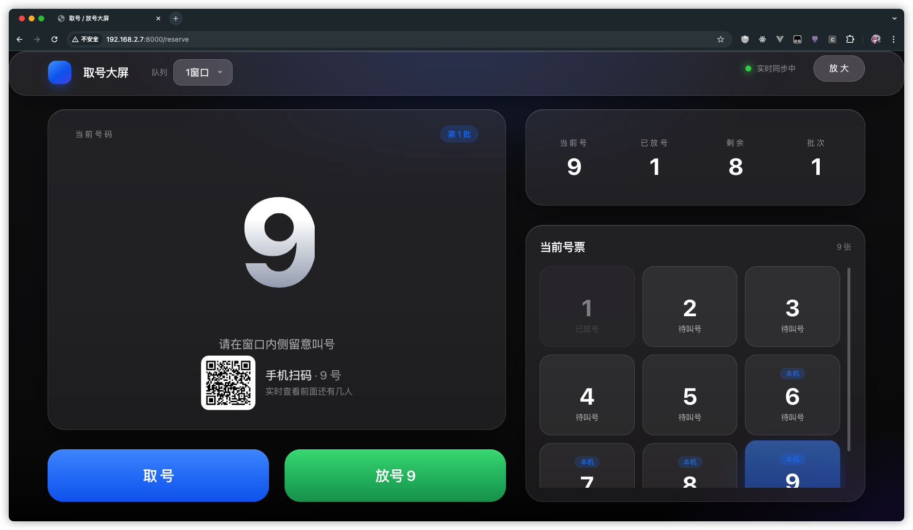
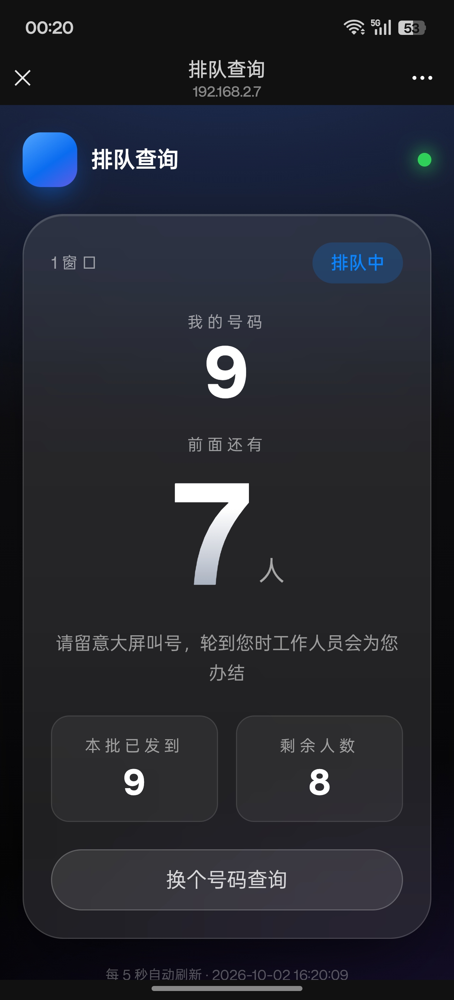

# ReserveApp · 预约取号系统




基于 Laravel 的轻量预约取号/放号系统，内置一个适合大厅大屏长期展示的**单页控制台**：超大号牌、取号/放号一键操作、队列状态实时轮询、本机号票管理。

## 功能特性

- **取号** `POST /api/reserve`：传入队列标识 `key`，返回 `{queue_key, batch_no, serial_no}` 三元组
- **放号** `DELETE /api/reserve`：传入 `key + batch_no + serial_no`，释放一个号；全部放完后自动进入换批流程
- **状态查询** `GET /api/reserve/state`：大屏每 5 秒轮询，展示当前号/已放号/剩余/批次
- **批次状态机**：某批次 `active_count` 归零 → 标记 `need_reset` → 下次取号自动开启新批次（批次号单调递增）
- **大屏控制台** `/reserve`：号牌大字随视口高度自适应、取号弹跳动画、号票网格 + 内部滚动、放大/全屏模式、断线退避重连、toast 反馈
- **多队列**：顶栏下拉切换，队列列表由 `config/reserve.php` 或环境变量 `RESERVE_QUEUE_OPTIONS` 配置
- 号票记录存于浏览器 localStorage（带版本号），刷新页面后仍可放号；界面只展示**当前批次**的号票

## 技术栈

| 层 | 技术 | 版本 |
|---|---|---|
| 后端框架 | Laravel | 8.75（PHP ^7.3 \| ^8.0，实际运行 PHP 8） |
| 数据库 | SQLite（默认，可切换 MySQL） | — |
| 前端模板 | Blade | — |
| 前端交互 | Alpine.js | ^3.4 |
| HTTP 客户端 | axios | ^0.21 |
| 样式 | Tailwind CSS | ^3.1 |
| 构建工具 | Laravel Mix（webpack 5） | ^6.0.6 |

> 注意：项目根目录的 `vite.config.js` 是遗留文件（引用的 `laravel-vite-plugin` 未安装），**构建一律走 Mix**。

## 快速开始

### 环境要求

- PHP >= 7.3（推荐 8.x），扩展：`openssl`、`pdo_sqlite`（或 `pdo_mysql`）、`mbstring`、`tokenizer`、`xml`、`curl`
- Composer 2.x
- Node.js >= 16 + npm

### 安装

```bash
# 1. 安装 PHP 依赖
composer install

# 2. 准备环境变量
cp .env.example .env
php artisan key:generate

# 3. 配置数据库（默认 SQLite，零配置）
#    .env 中：
#    DB_CONNECTION=sqlite
#    DB_DATABASE=/绝对路径/database/database.sqlite
touch database/database.sqlite   # 文件已存在则跳过

# 4. 建表
php artisan migrate

# 5. 安装前端依赖并编译
npm install
npm run prod        # 生产构建；开发时用 npm run watch 热更新

# 6. 启动
php artisan serve
```

访问：

- 大屏控制台：<http://localhost:8000/reserve>
- 探活接口：<http://localhost:8000/api/health>

### 多队列配置

`.env` 中用英文逗号分隔（默认只有一个「默认队列」）：

```env
RESERVE_QUEUE_OPTIONS="1号窗口,2号窗口,急诊"
```

## API 一览

统一返回 `{code, message, data?}`：`code:0` 成功、`code:1` 业务失败、422 参数校验失败、500 异常。

| 方法 | 路径 | 入参 | 说明 |
|---|---|---|---|
| POST | `/api/reserve` | `key`（队列标识，必填） | 取号，成功返回 `{queue_key, batch_no, serial_no}` |
| DELETE | `/api/reserve` | `key`、`batch_no`、`serial_no` | 放号；`code:1` 表示号不存在或重复放号 |
| GET | `/api/reserve/state` | `key`（query） | 查询队列状态：`batch_no / current_no / released_total / remaining / need_reset` |
| GET | `/api/health` | — | 探活 |

## 业务规则（批次状态机）

1. 取号时在同一队列、当前未办结批次（`need_reset = 0`）上 `current_no + 1`，`active_count + 1`。
2. 放号使 `active_count` 归零 → `need_reset = 1`，此后取号会开新批次（`batch_no` 取历史最大 + 1），号码重新从 1 开始。
3. 号的唯一性由 `(queue_key, batch_no, serial_no)` 三元组保证。
4. 状态查询接口刻意不加锁、不开事务，避免与高频率轮询互相阻塞。

## 目录结构速览

```
app/Http/Controllers/Api/ReserveController.php   # 取号 / 放号 / 状态查询
app/Models/Customer.php                          # 取号记录（customers 表）
app/Models/SerialGenerator.php                   # 号池聚合（serial_generator 表）
config/reserve.php                               # 队列选项配置
resources/views/reserve/                         # 大屏 Blade 视图（index + partials）
resources/js/reserve/                            # 前端分层：config / api / store / storage / app
resources/css/app.css                            # Tailwind
routes/api.php                                   # API 路由
routes/web.php                                   # /reserve 页面路由
tests/Feature/ReserveStateTest.php               # 状态接口测试
```

面向 AI 智能体与协作者的完整规范（编码约定、前端分层、接口契约、常见坑位）见项目根的 **[AGENTS.md](./AGENTS.md)**。

## 测试

```bash
php artisan test                  # 或 ./vendor/bin/phpunit
php artisan test --filter=ReserveStateTest
```

## 部署要点

1. `composer install --optimize-autoloader --no-dev`
2. `npm ci && npm run prod`
3. `php artisan config:cache && php artisan route:cache`
4. Web 服务器（Nginx/Apache）将域名指向 `public/` 目录
5. 生产环境务必 `APP_ENV=production`、`APP_DEBUG=false`、配置好 `APP_KEY`

数据库默认 SQLite，适合单机/小流量场景；如需 MySQL，修改 `.env` 的 `DB_*` 配置即可，迁移文件无需改动。

## License

MIT
